# 🏗️ VibeTrade Technical Architecture Diagram

## Complete System Overview with Visual Styling

```mermaid
%%{init: {'theme':'base', 'themeVariables': { 'edgeLabelBackground':'#ffffff', 'primaryColor':'#ffffff', 'lineColor':'#000000'}}}%%
graph TB
subgraph ext["External Data Sources"]
    FINN["Finnhub WebSocket<br/>Live BTC prices + trades<br/>4-second bar aggregation"]
    PM["Polymarket API<br/>Prediction markets & odds"]
    RD["Reddit JSON<br/>Social sentiment scraping"]
    ALPACA["Alpaca Paper Trading<br/>Orders & positions API"]
end

subgraph workers["Background Workers"]
    DI["Data Ingest Worker<br/>Runs every 10 minutes<br/>Fetches all external data"]
    TM["Trigger Monitor<br/>Runs every 1 second<br/>Calculates risk score"]
    AW["Anomaly Worker<br/>Runs every 5 seconds<br/>Crash/moon detection"]
end

subgraph services["Core Services"]
    FINN_SVC["Finnhub Service<br/>• Live price cache<br/>• Trade aggregation<br/>• Crash/moon injection<br/>• Price override system"]
    ALPACA_SVC["Alpaca Trading Service<br/>• Place orders<br/>• Get positions<br/>• Cancel orders<br/>• Account balance"]
    ANOM_SVC["Anomaly Monitor<br/>• Z-score detection<br/>• Rate of change analysis<br/>• Trend break detection<br/>• Statistical modeling"]
    PM_SVC["Polymarket Service<br/>• Fetch markets<br/>• Parse odds & volume"]
    RD_SVC["Reddit Service<br/>• Scrape posts<br/>• Sentiment analysis"]
    VOICE_SVC["Voice Session Manager<br/>• ElevenLabs STT/TTS<br/>• Session management<br/>• Interrupt handling"]
    OAI["OpenAI Service<br/>• GPT-4o-mini (data processing)<br/>• GPT-4o (agent brain)"]
end

subgraph db["Database (Supabase)"]
    DB_MC[("market_context<br/>Time-series data<br/>Risk scores & sentiment")]
    DB_FI[("feed_items<br/>Polymarket + Reddit<br/>UI display data")]
    DB_P[("portfolio<br/>Balance & lock status")]
    DB_T[("trades<br/>Orders & history")]
end

subgraph api["API Layer (FastAPI)"]
    REST["REST Endpoints<br/>/api/portfolio<br/>/api/orders<br/>/api/polymarket<br/>/api/reddit<br/>/api/vibes"]
    WS_AGENT["Voice WebSocket<br/>/ws/voice/agent<br/>Bidirectional voice chat"]
    WS_MARKET["Market WebSocket<br/>/ws/crypto<br/>Live price streaming"]
    AGENT["LangGraph Agent<br/>• get_market_sentiment()<br/>• list_holdings()<br/>• execute_trade()<br/>• lock_user_account()"]
end

subgraph frontend["Frontend (Next.js + React)"]
    UI_CHART["Live Price Charts<br/>TradingView Lightweight Charts"]
    UI_TRADE["Trading Panel<br/>BUY/SELL interface"]
    UI_PORT["Portfolio Panel<br/>Positions + active orders"]
    UI_HIST["History Panel<br/>Closed trades + P&L"]
    UI_POLY["Polymarket Feed<br/>Live prediction odds"]
    UI_RED["Reddit Feed<br/>Sentiment posts"]
    UI_AGENT["Voice Agent<br/>VRM avatar + transcript"]
    UI_RISK["Risk Meter<br/>0-100 danger gauge"]
end

%% Data Flow: External Sources → Services
FINN -->|WebSocket stream| FINN_SVC
FINN_SVC -->|Price updates| DI
PM -->|API fetch| PM_SVC
PM_SVC -->|Markets data| DI
RD -->|JSON scrape| RD_SVC
RD_SVC -->|Posts data| DI
ALPACA -->|REST API| ALPACA_SVC

%% Workers → Database
DI -->|Write market context<br/>sentiment, prices, hype| DB_MC
DI -->|Write feed items<br/>Polymarket + Reddit| DB_FI
TM -->|Read latest context| DB_MC
TM -->|Update risk score| DB_MC
AW -->|Monitor portfolio| DB_P
AW -->|Check BTC price| FINN_SVC
AW -->|Analyze anomalies| ANOM_SVC

%% Crash/Moon Detection Flow
AW -->|Detect crash/moon<br/>BTC < $60k or > $100k| VOICE_SVC
VOICE_SVC -->|Speak alert| WS_AGENT
FINN_SVC -->|Price override<br/>Simulate crash/moon| WS_MARKET

%% Trigger Monitor → Alert Flow
TM -->|Risk score > 80| WS_AGENT
TM -->|Generate alert text| OAI

%% REST API → Database
REST -->|Read/write| DB_P
REST -->|Read/write| DB_T
REST -->|Read| DB_MC
REST -->|Read| DB_FI
REST -->|Place orders| ALPACA_SVC
REST -->|Get positions| ALPACA_SVC

%% Agent Tools → Database
AGENT -->|Read sentiment| DB_MC
AGENT -->|Read portfolio/orders| DB_P
AGENT -->|Read trades| DB_T
AGENT -->|Write pending trade| DB_T
AGENT -->|Lock account| DB_P

%% Voice WebSocket Flow
UI_AGENT -->|User voice audio| WS_AGENT
WS_AGENT -->|Audio chunks| VOICE_SVC
VOICE_SVC -->|Transcribe STT| OAI
WS_AGENT -->|User text| AGENT
AGENT -->|Generate response| OAI
AGENT -->|Response text| VOICE_SVC
VOICE_SVC -->|TTS audio| WS_AGENT
WS_AGENT -->|Agent audio| UI_AGENT

%% Market WebSocket Flow
FINN_SVC -->|Live prices<br/>4-second bars| WS_MARKET
WS_MARKET -->|Price updates| UI_CHART

%% REST → Frontend
REST -->|Portfolio data| UI_PORT
REST -->|Orders data| UI_PORT
REST -->|Trade history| UI_HIST
REST -->|Polymarket markets| UI_POLY
REST -->|Reddit posts| UI_RED
REST -->|Risk score + vibes| UI_RISK

%% Trading Flow
UI_TRADE -->|Manual order| REST
REST -->|Execute via Alpaca| ALPACA_SVC
ALPACA_SVC -->|Order confirmation| DB_T

%% Agent Trading Flow (with approval)
AGENT -->|Propose trade| WS_AGENT
WS_AGENT -->|Approval request| UI_AGENT
UI_AGENT -->|User confirms/denies| WS_AGENT
WS_AGENT -->|Resume agent| AGENT
AGENT -->|Execute if approved| ALPACA_SVC

%% Styling with vibrant colors for nodes
classDef external fill:#ff6b6b,stroke:#c92a2a,stroke-width:3px,color:#fff
classDef worker fill:#20c997,stroke:#0ca678,stroke-width:3px,color:#fff
classDef service fill:#a29bfe,stroke:#6c5ce7,stroke-width:3px,color:#fff
classDef db fill:#ffd93d,stroke:#f8b500,stroke-width:3px,color:#000
classDef api fill:#48dbfb,stroke:#0abde3,stroke-width:3px,color:#000
classDef frontend fill:#ff6348,stroke:#e84118,stroke-width:3px,color:#fff

%% Styling for subgraph backgrounds
classDef extBg fill:#ffe0e0,stroke:#ff6b6b,stroke-width:4px,color:#000
classDef workerBg fill:#d4f4e8,stroke:#20c997,stroke-width:4px,color:#000
classDef serviceBg fill:#e8e4fc,stroke:#a29bfe,stroke-width:4px,color:#000
classDef dbBg fill:#fff9e0,stroke:#ffd93d,stroke-width:4px,color:#000
classDef apiBg fill:#e0f5ff,stroke:#48dbfb,stroke-width:4px,color:#000
classDef frontendBg fill:#ffe5e0,stroke:#ff6348,stroke-width:4px,color:#000

class FINN,PM,RD,ALPACA external
class DI,TM,AW worker
class FINN_SVC,ALPACA_SVC,ANOM_SVC,PM_SVC,RD_SVC,VOICE_SVC,OAI service
class DB_MC,DB_FI,DB_P,DB_T db
class REST,WS_AGENT,WS_MARKET,AGENT api
class UI_CHART,UI_TRADE,UI_PORT,UI_HIST,UI_POLY,UI_RED,UI_AGENT,UI_RISK frontend

class ext extBg
class workers workerBg
class services serviceBg
class db dbBg
class api apiBg
class frontend frontendBg
```

## 🎨 Color Legend

- 🔴 **Red** - External data sources (Finnhub, Polymarket, Reddit, Alpaca)
- 🟢 **Green** - Background workers (Data Ingest, Trigger Monitor, Anomaly Worker)
- 🟣 **Purple** - Core services (Finnhub, Alpaca Trading, Anomaly Monitor, etc.)
- 🟡 **Yellow** - Database tables (Supabase)
- 🔵 **Blue** - API layer (REST, WebSockets, LangGraph Agent)
- 🟠 **Orange** - Frontend components (Next.js/React)

## 🚨 Key Technical Highlights

### Crash/Moon Detection System
1. **Anomaly Worker** monitors every 5 seconds:
   - BTC price < $60,000 → **CRASH detected**
   - BTC price > $100,000 → **MOON detected**
   - Portfolio balance drops > 5%
   - Statistical anomalies (Z-score > 2.5)

2. **Detection triggers**:
   - Voice alert via ElevenLabs
   - WebSocket interrupt to frontend
   - Agent receives system message

3. **Demo mode**:
   - Finnhub Service can override real prices
   - Ramps from current → target over 20 seconds
   - Simulates realistic market movements

### Real-Time Data Flow
- Finnhub WebSocket → 4s bar aggregation → Frontend charts
- Price overrides for crash/moon demos
- Bidirectional voice agent communication